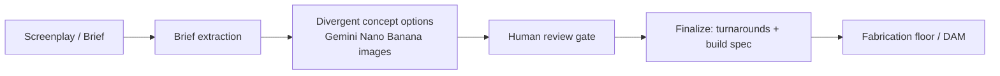

<div align="center">

</div>

# Artifact: Art Department Hero Prop Pipeline

**Artifact** is a production tool for the **art departments of film, television, and game cinematics
crews** — Production Designers, Prop Masters, and Fabricators. It structures the creative lifecycle
of a **"hero prop"** (the signature object the camera studies in close-up — a relic, a map, an
ancient device, a key): from **screenplay text → structured brief → divergent AI concept designs →
human review gates → seed-locked turnaround sheets + build/CMF specs** for the fabrication floor.

> Not an academic/fine-art tool — it's purpose-built for on-set/production art departments.

---

## How it works



Three decoupled components communicate over REST:

```
/
├── app/            [Frontend]  React 19 + Vite + TypeScript + Tailwind (login-gated Studio dashboard)
├── app-backend/    [Backend]   Node + Express + TypeScript (JWT auth, Firestore, agent proxy, SSE, webhook)
└── agent-system/   [Agent]     Python 3.12 + FastAPI + Google ADK (reasoning core; Vertex AI Agent Engine)
```

- **Frontend** collects the brief (paste / upload / manual), then calls the backend to create a prop
  and polls for the real generated options + images.
- **Backend** verifies a JWT, proxies to the agent, and mirrors agent state into **Firestore**
  (sync-on-read), fanning out live updates over SSE.
- **Agent** runs three Google ADK subagents (`OptionsGenerator`, `SelectionRecorder`,
  `AssetFinisher`), calls **Gemini** for reasoning and **Nano Banana** image models for concept +
  hero imagery, and stores images in **GCS** (served via signed URLs). It runs in-process locally or
  on **Vertex AI Agent Engine** in the cloud — same code, no change.

---

## Setup — two equally-supported paths

Both paths take a newcomer from zero to running. Path A needs no cloud account.

### Path A — Run locally (no Google Cloud account required)

**Prerequisites:** Node.js 18+, Python 3.10+, and (for the backend's database) the Firestore
emulator via the Google Cloud CLI (`gcloud`) with Java, **or** just point the backend at a real
Firestore later. The **agent runs fully offline in stub mode**.

Open three terminals:

```bash
# Terminal 1 — Agent (offline stub mode, no GCP needed)
cd agent-system
python -m venv .venv && source .venv/bin/activate    # Windows: .venv\Scripts\activate
pip install -r requirements.txt
USE_STUBS=true uvicorn api.app:app --host 0.0.0.0 --port 8080 --reload
#   API docs: http://localhost:8080/docs   (interactive CLI alternative: USE_STUBS=true python cli.py)
```

```bash
# Terminal 2 — Firestore emulator (the backend's local database)
gcloud emulators firestore start --host-port=localhost:8085
#   No emulator/Java? Skip this and set the backend to a real Firestore (see Path B, step 3).
```

```bash
# Terminal 3 — Backend (Express)
cd app-backend
npm install
cp .env.example .env
#   In .env set:  GCP_PROJECT_ID=demo-artifact   FIRESTORE_EMULATOR_HOST=localhost:8085
#   Leave APP_ACCESS_PASSWORD / APP_JWT_SECRET UNSET -> auth is disabled for easy local dev.
npm run dev            # http://localhost:5000
```

```bash
# Terminal 4 — Frontend (React/Vite)
cd app
npm install
cp .env.example .env.local
#   In .env.local set:  VITE_BACKEND_URL=http://localhost:5000/api
npm run dev            # http://localhost:3000
```

Open **http://localhost:3000**. With auth disabled (dev), you go straight in; the agent runs stubbed
so the full flow works without spending anything.

### Path B — Deploy to Google Cloud (zero → live)

**Prerequisites:** a Google Cloud project with billing, and `gcloud` authenticated
(`gcloud auth login && gcloud config set project YOUR_PROJECT`).

```bash
export PROJECT=YOUR_PROJECT REGION=us-central1

# 1. Enable the APIs
gcloud services enable run.googleapis.com aiplatform.googleapis.com firestore.googleapis.com \
  storage.googleapis.com secretmanager.googleapis.com cloudbuild.googleapis.com

# 2. Create Firestore (Native) + a GCS bucket for generated images
gcloud firestore databases create --location=$REGION
gcloud storage buckets create gs://$PROJECT-artifact-assets --location=$REGION

# 3. Create secrets (login password, JWT signing key, agent bearer token)
printf '%s' "$(openssl rand -hex 12)" | gcloud secrets create artifact-login-password --data-file=-
printf '%s' "$(openssl rand -hex 48)" | gcloud secrets create artifact-jwt-secret     --data-file=-
printf '%s' "$(openssl rand -hex 32)" | gcloud secrets create artifact-agent-token    --data-file=-

# 4. Deploy the agent (FastAPI + ADK) — cpu-boost keeps ML imports cold-start-safe
gcloud run deploy artifact-agent --source agent-system --region $REGION --allow-unauthenticated \
  --min-instances 0 --cpu-boost --memory 2Gi --cpu 2 --timeout 600 \
  --set-env-vars USE_STUBS=false,GCP_PROJECT_ID=$PROJECT,GOOGLE_GENAI_USE_VERTEXAI=1,GCS_BUCKET_NAME=$PROJECT-artifact-assets \
  --set-secrets API_BEARER_TOKEN=artifact-agent-token:latest

# 5. Deploy the backend (Express + Firestore) — point it at the agent
gcloud run deploy artifact-backend --source app-backend --region $REGION --allow-unauthenticated \
  --min-instances 0 --set-env-vars NODE_ENV=production,GCP_PROJECT_ID=$PROJECT,AGENT_SYSTEM_API_URL=<AGENT_URL>/v1 \
  --set-secrets APP_ACCESS_PASSWORD=artifact-login-password:latest,APP_JWT_SECRET=artifact-jwt-secret:latest,AGENT_SYSTEM_BEARER_TOKEN=artifact-agent-token:latest

# 6. Build + deploy the frontend (bake the backend URL at build time)
gcloud builds submit --config app/cloudbuild.yaml \
  --substitutions _VITE_BACKEND_URL=<BACKEND_URL>/api,_IMAGE=$REGION-docker.pkg.dev/$PROJECT/cloud-run-source-deploy/artifact-frontend:latest app
gcloud run deploy artifact-frontend --image <IMAGE> --region $REGION --allow-unauthenticated --min-instances 0

# 7. (Optional) Deploy the ADK reasoning core to Vertex AI Agent Engine, then set
#    AGENT_ENGINE_RESOURCE_NAME on the agent service (see agent-system/README.md).
```

Retrieve your login password with
`gcloud secrets versions access latest --secret=artifact-login-password`.
Full teardown: `./scripts/teardown.sh --yes`.

---

## How Google Cloud is used

| Service | Role in Artifact | Code |
|---|---|---|
| **Vertex AI Agent Engine** (Agent Builder) | Managed runtime for the ADK reasoning core | [`agent-system/deploy/deploy_agent_engine.py`](/agent-system/deploy/deploy_agent_engine.py), [`agent/platform_adapter.py`](/agent-system/agent/platform_adapter.py) |
| **Google ADK** | Agent framework — root `LlmAgent` + subagents | [`agent-system/agent/adk/root_agent.py`](/agent-system/agent/adk/root_agent.py), [`agent/adk/core.py`](/agent-system/agent/adk/core.py) |
| **Gemini via Google Gen AI SDK** | Reasoning (`gemini-2.5-flash`) + Nano Banana image gen | [`agent-system/gen/image_jobs.py`](/agent-system/gen/image_jobs.py), [`config.py`](/agent-system/config.py) |
| **Cloud Run** | All 3 services, scale-to-zero | [`*/Dockerfile`](/agent-system/Dockerfile) |
| **Firestore (Native)** | Serverless persistence | [`app-backend/src/db.ts`](/app-backend/src/db.ts), [`store/repository.py`](/agent-system/store/repository.py) |
| **Cloud Storage** | Generated images (IAM V4 signed URLs) | [`agent-system/api/storage.py`](/agent-system/api/storage.py) |
| **Secret Manager** | All credentials (never in the bundle) | deploy flags (`--set-secrets`) |
| **Cloud Build + Artifact Registry** | Container builds | [`app/cloudbuild.yaml`](/app/cloudbuild.yaml) |

Image generation uses `generate_content(response_modalities=["IMAGE"])` on Nano Banana
(`gemini-3.1-flash-image`, `gemini-3-pro-image`) — **not** `generate_images` (they are Gemini image
models, not Imagen).

## How Confluent (Kafka) is used

An **optional** prop-lifecycle event backbone. Every state transition emits an event; delivery is
feature-flagged: a durable **Confluent Cloud** topic (`artifact.prop.events`) and/or an HTTP
**webhook push** (default, keeps the backend scale-to-zero).
- Producer + webhook: [`agent-system/events/producer.py`](/agent-system/events/producer.py), [`events/webhook.py`](/agent-system/events/webhook.py)
- Backend consumer + shared apply + SSE: [`app-backend/src/events/kafkaConsumer.ts`](/app-backend/src/events/kafkaConsumer.ts), [`propEvents.ts`](/app-backend/src/events/propEvents.ts)
- One-command cluster lifecycle (with storage caps + free auto-teardown): [`scripts/confluent-cluster.sh`](/scripts/confluent-cluster.sh)

## Foundation development

The agent system's initial foundation build was performed by **Bob, an IBM AI software-engineering
agent** (spec ingestion, workspace layout, first end-to-end build of `agent-system/`). That
foundation is built on **Google ADK** and deployed to **Google Cloud Vertex AI Agent Engine**.

---

## The three components
- **Frontend** — [app/README.md](/app/README.md)
- **Backend** — [app-backend/README.md](/app-backend/README.md)
- **Agent system** — [agent-system/README.md](/agent-system/README.md)

**Auth:** the deployed app is password-gated; the backend issues a short-lived JWT. In local dev,
leaving `APP_ACCESS_PASSWORD`/`APP_JWT_SECRET` unset disables auth entirely.
